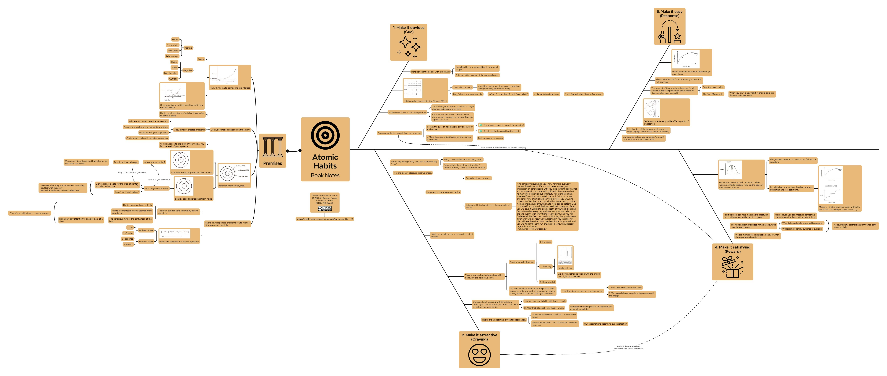

I've spent a lot of time learning about art and creativity.  I like to record my notes as [mind maps](https://en.wikipedia.org/wiki/Mind_map).  Mind maps are like a tree.  Start from the center (the trunk) and follow the branches outward into more specific, nuanced information.

### Atomic Habits

### Creativity, Inc.

### The War of Art

